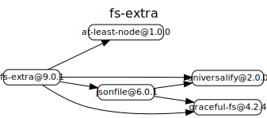
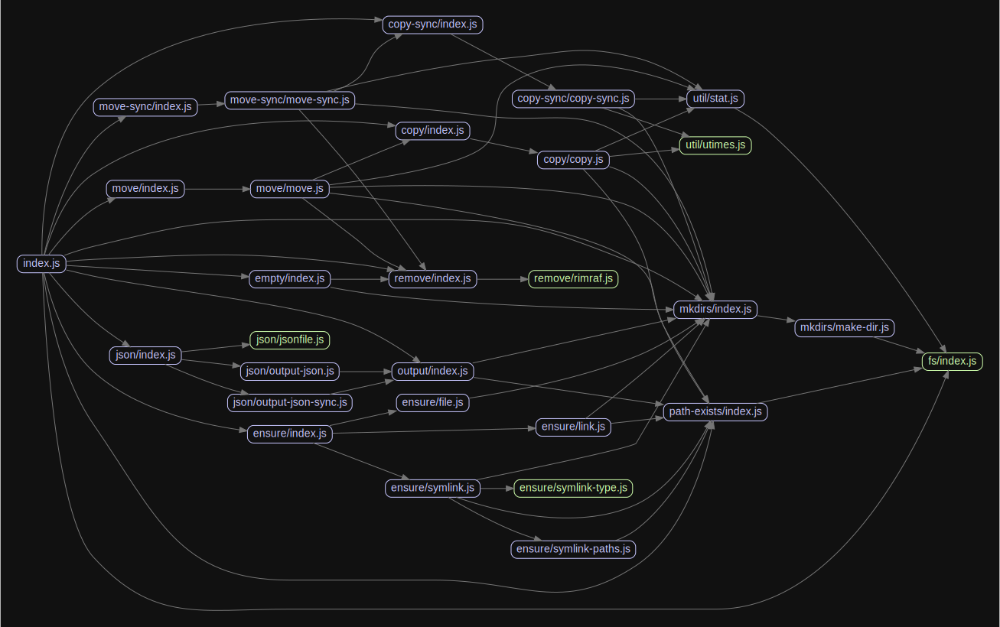

# 源码分析

## 文件结构

``` bash
/Users/liufang/openSource/FunnyLiu/node-fs-extra
├── lib
|  ├── __tests__
|  |  └── promise.test.js
|  ├── copy
|  |  ├── __tests__
|  |  |  ├── copy-case-insensitive-paths.test.js
|  |  |  ├── copy-dev-null.test.js
|  |  |  ├── copy-gh-89.test.js
|  |  |  ├── copy-permissions.test.js
|  |  |  ├── copy-preserve-timestamp.test.js
|  |  |  ├── copy-prevent-copying-identical.test.js
|  |  |  ├── copy-prevent-copying-into-itself.test.js
|  |  |  ├── copy-readonly-dir.test.js
|  |  |  ├── copy.test.js
|  |  |  └── ncp
|  |  |     ├── README.md
|  |  |     ├── broken-symlink.test.js
|  |  |     ├── fixtures
|  |  |     |  ├── modified-files
|  |  |     |  |  ├── out
|  |  |     |  |  |  └── a
|  |  |     |  |  └── src
|  |  |     |  |     └── a
|  |  |     |  └── regular-fixtures
|  |  |     |     ├── out
|  |  |     |     |  ├── a
|  |  |     |     |  ├── b
|  |  |     |     |  ├── c
|  |  |     |     |  ├── d
|  |  |     |     |  ├── e
|  |  |     |     |  ├── f
|  |  |     |     |  └── sub
|  |  |     |     |     ├── a
|  |  |     |     |     └── b
|  |  |     |     └── src
|  |  |     |        ├── a
|  |  |     |        ├── b
|  |  |     |        ├── c
|  |  |     |        ├── d
|  |  |     |        ├── e
|  |  |     |        ├── f
|  |  |     |        └── sub
|  |  |     |           ├── a
|  |  |     |           └── b
|  |  |     ├── ncp-error-perm.test.js
|  |  |     ├── ncp.test.js
|  |  |     └── symlink.test.js
|  |  ├── copy.js
|  |  └── index.js
|  ├── copy-sync
|  |  ├── __tests__
|  |  |  ├── broken-symlink.test.js
|  |  |  ├── copy-sync-case-insensitive-paths.test.js
|  |  |  ├── copy-sync-dir.test.js
|  |  |  ├── copy-sync-file.test.js
|  |  |  ├── copy-sync-preserve-timestamp.test.js
|  |  |  ├── copy-sync-prevent-copying-identical.test.js
|  |  |  ├── copy-sync-prevent-copying-into-itself.test.js
|  |  |  ├── copy-sync-readonly-dir.test.js
|  |  |  └── symlink.test.js
|  |  ├── copy-sync.js
|  |  └── index.js
|  ├── empty
|  |  ├── __tests__
|  |  |  ├── empty-dir-sync.test.js
|  |  |  └── empty-dir.test.js
|  |  └── index.js
|  ├── ensure
|  |  ├── __tests__
|  |  |  ├── create.test.js
|  |  |  ├── ensure.test.js
|  |  |  ├── link.test.js
|  |  |  ├── symlink-paths.test.js
|  |  |  ├── symlink-type.test.js
|  |  |  └── symlink.test.js
|  |  ├── file.js
|  |  ├── index.js
|  |  ├── link.js
|  |  ├── symlink-paths.js
|  |  ├── symlink-type.js
|  |  └── symlink.js
|  ├── fs
|  |  ├── __tests__
|  |  |  ├── copyFile.test.js
|  |  |  ├── fs-integration.test.js
|  |  |  ├── multi-param.test.js
|  |  |  ├── mz.test.js
|  |  |  └── realpath.test.js
|  |  └── index.js
|  ├── index.js
|  ├── json
|  |  ├── __tests__
|  |  |  ├── jsonfile-integration.test.js
|  |  |  ├── output-json-sync.test.js
|  |  |  ├── output-json.test.js
|  |  |  ├── promise-support.test.js
|  |  |  └── read.test.js
|  |  ├── index.js
|  |  ├── jsonfile.js
|  |  ├── output-json-sync.js
|  |  └── output-json.js
|  ├── mkdirs
|  |  ├── __tests__
|  |  |  ├── chmod.test.js
|  |  |  ├── clobber.test.js
|  |  |  ├── issue-209.test.js
|  |  |  ├── issue-93.test.js
|  |  |  ├── mkdir.test.js
|  |  |  ├── mkdirp.test.js
|  |  |  ├── opts-undef.test.js
|  |  |  ├── perm.test.js
|  |  |  ├── perm_sync.test.js
|  |  |  ├── race.test.js
|  |  |  ├── rel.test.js
|  |  |  ├── root.test.js
|  |  |  └── sync.test.js
|  |  ├── index.js
|  |  └── make-dir.js
|  ├── move
|  |  ├── __tests__
|  |  |  ├── move-case-insensitive-paths.test.js
|  |  |  ├── move-prevent-moving-identical.test.js
|  |  |  ├── move-prevent-moving-into-itself.test.js
|  |  |  └── move.test.js
|  |  ├── index.js
|  |  └── move.js
|  ├── move-sync
|  |  ├── __tests__
|  |  |  ├── move-sync-case-insensitive-paths.test.js
|  |  |  ├── move-sync-prevent-moving-identical.test.js
|  |  |  ├── move-sync-prevent-moving-into-itself.test.js
|  |  |  └── move-sync.test.js
|  |  ├── index.js
|  |  └── move-sync.js
|  ├── output
|  |  ├── __tests__
|  |  |  └── output.test.js
|  |  └── index.js
|  ├── path-exists
|  |  ├── __tests__
|  |  |  ├── path-exists-sync.test.js
|  |  |  └── path-exists.test.js
|  |  └── index.js
|  ├── remove
|  |  ├── __tests__
|  |  |  ├── remove-dir.test.js
|  |  |  ├── remove-file.test.js
|  |  |  ├── remove-sync-dir.test.js
|  |  |  ├── remove-sync-file.test.js
|  |  |  └── remove.test.js
|  |  ├── index.js
|  |  └── rimraf.js
|  └── util
|     ├── __tests__
|     |  ├── stat.test.js
|     |  └── utimes.test.js
|     ├── stat.js
|     └── utimes.js

directory: 39 file: 154

ignored: directory (1)

```

## 外部模块依赖



## 内部模块依赖


  